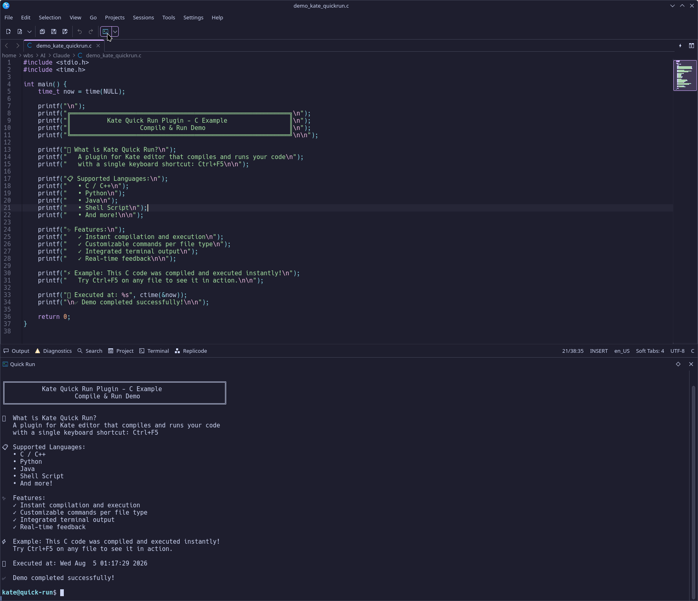
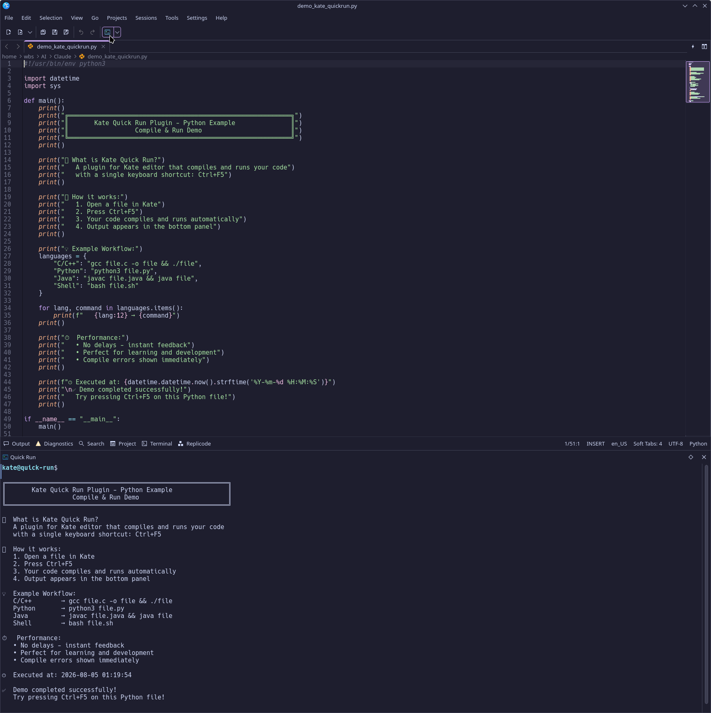
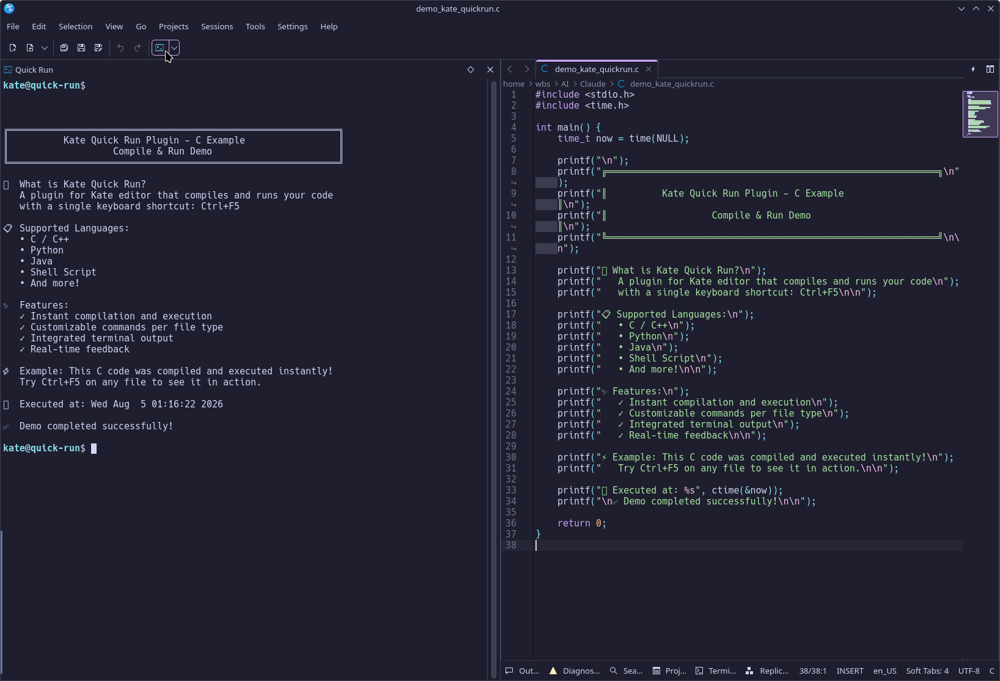
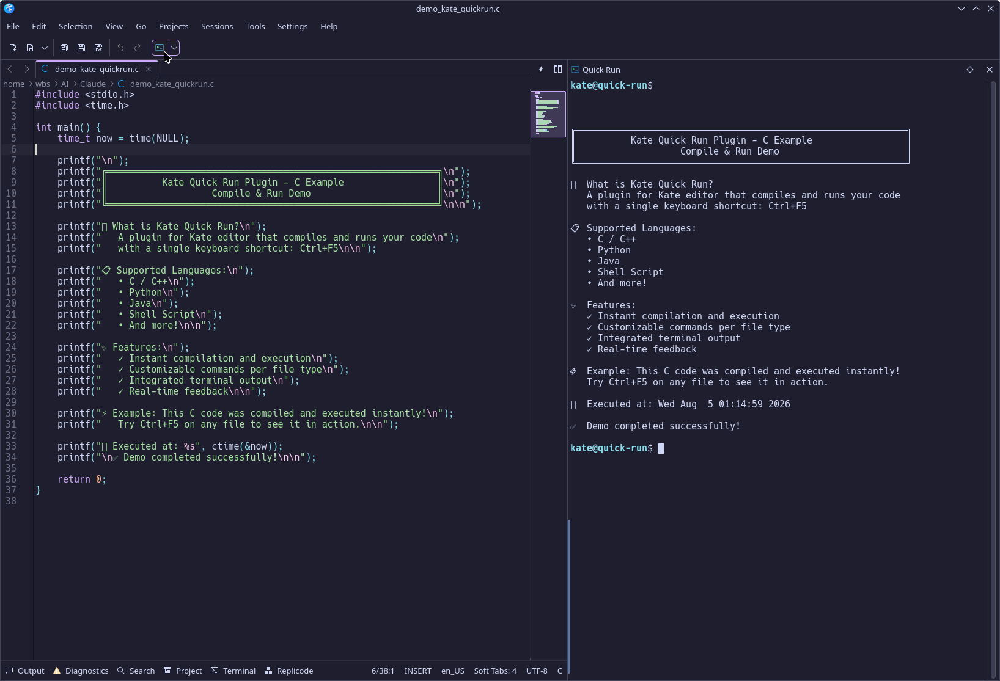
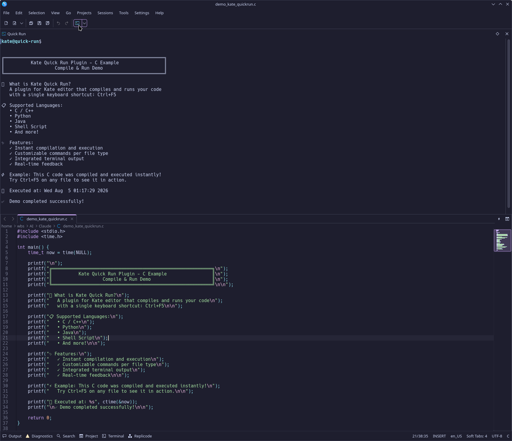
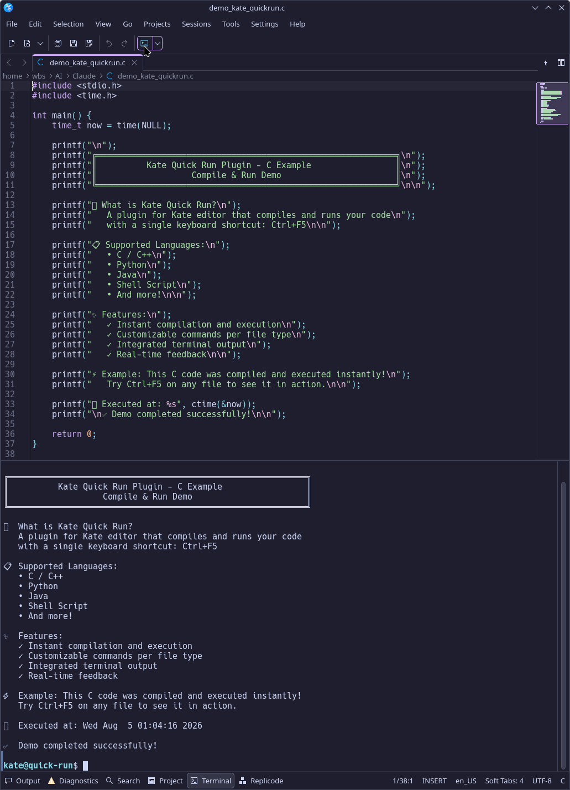
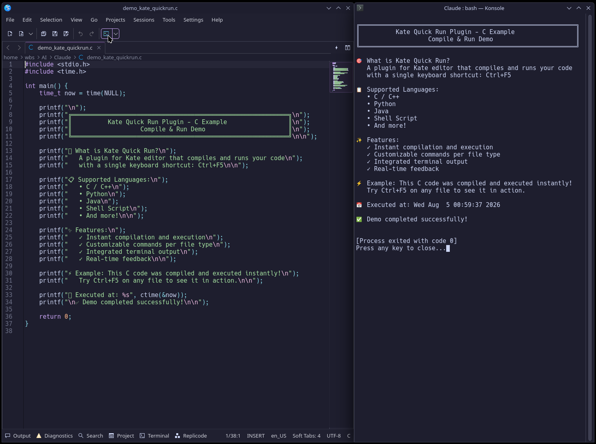
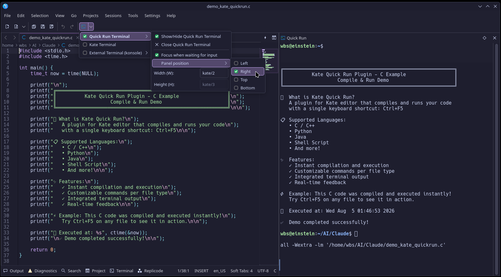
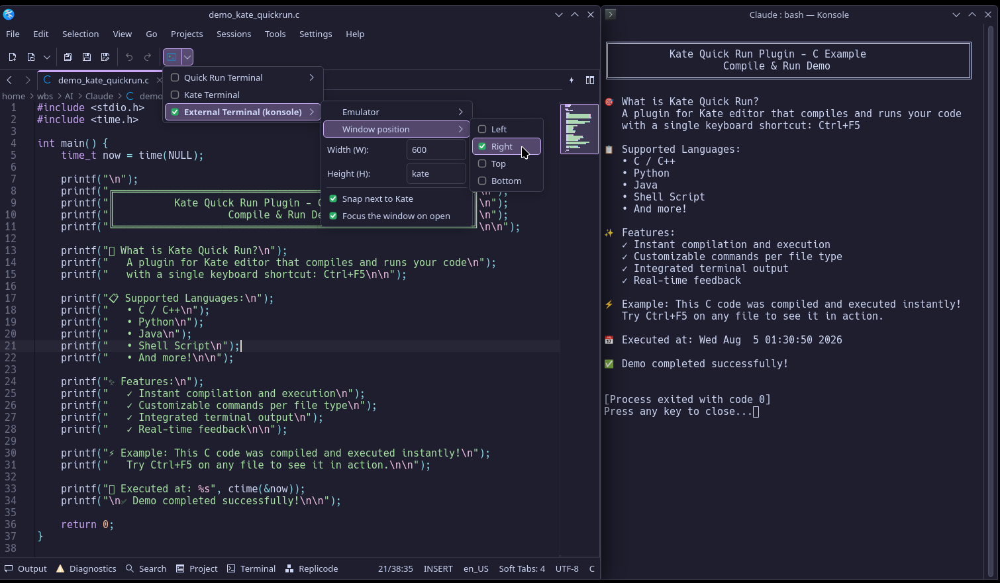

# Kate Quick Run Plugin 🚀

A native plugin for the **Kate text editor (KDE Frameworks 6)** that compiles and
runs the file open in the editor with a single shortcut — **no project, no
Makefile, no configuration**. The output goes to a dedicated terminal panel, to
Kate's embedded Terminal, or to an external terminal window, your choice.

> Developed and tested on Debian Trixie, KDE Plasma 6 (**Wayland**), Kate 25.04,
> Qt 6.8, KF6. See [X11 and Wayland](#-x11-and-wayland).

---

## ✨ Features

- **One shortcut to run** — press `Ctrl + F5` to save, compile and run the current
  file.
- **Multi-language** — built-in support for C, C++, Python, Rust, Go, Java and
  JavaScript (Node), plus user-defined languages you can add in the settings.
- **Three run destinations**, switchable from the toolbar button (or the config
  page), each with its own options:
  - **Quick Run Terminal** — a dedicated terminal in its own dockable panel,
    separate from your working shell.
  - **Kate Terminal** — reuses Kate's embedded *Terminal* plugin.
  - **External Terminal** — any terminal emulator installed on your system,
    optionally snapped next to the Kate window.
- **Smart focus** — focus moves to the terminal only when the running program
  actually blocks waiting for keyboard input (C, C++, Python, …). Otherwise it
  stays in the editor.
- **No D-Bus, no security warning** — the embedded terminal is driven through the
  public KParts `TerminalInterface` API, so Konsole's `sendText`/`runCommand`
  warning never appears. (See [Security](#-security).)
- **Dynamic terminal list** — external emulators are discovered from the
  freedesktop.org `TerminalEmulator` category; you see exactly what is installed.
- **Configurable appearance** — pick the toolbar icon with the system icon chooser
  and set the button text.
- **Localizable** — English by default, with a Brazilian Portuguese translation
  included.

---

## 🖼️ Screenshots

### Quick Run Terminal — C Demo

Dedicated terminal running C code from bottom panel:



### Quick Run Terminal — Python Demo

Same terminal running Python:



### Docking Positions

The terminal is movable and can be docked on any side:

| Left | Right | Top |
|---|---|---|
|  |  |  |

### Kate's Embedded Konsole Terminal

Reuse Kate's built-in terminal:



### External Terminal Mode

Run in any terminal emulator (Konsole, GNOME Terminal, etc.):



### Configuration Panels

Customize languages, compile flags, terminal destination, and more:

| Quick Run Options | External Terminal Options |
|---|---|
|  |  |

---

## 📦 Dependencies

Build tools and KDE/Qt6 development headers.

**Debian / Ubuntu (KDE Plasma 6):**
```bash
sudo apt install build-essential cmake extra-cmake-modules gettext \
  qt6-base-dev libkf6texteditor-dev libkf6parts-dev libkf6i18n-dev \
  libkf6iconthemes-dev libkf6service-dev libkf6xmlgui-dev \
  libkf6coreaddons-dev libkf6config-dev
```

**Arch Linux / Manjaro:**
```bash
sudo pacman -S base-devel cmake extra-cmake-modules gettext \
  ktexteditor kparts ki18n kiconthemes kservice kxmlgui kconfig \
  kcoreaddons qt6-base
```

Runtime: **Kate**, and **`konsole-kpart`** (Debian/Ubuntu) / **`konsole`** (Arch)
for the *Quick Run Terminal* mode.

---

## 🛠️ Installation

### Option 1 — build from source (any distro)

```bash
git clone https://github.com/wyllianbs/kate-quickrun.git
cd kate-quickrun
cmake -S . -B build -DCMAKE_BUILD_TYPE=Release
cmake --build build -j"$(nproc)"
sudo cmake --install build
kbuildsycoca6 --noincremental   # refresh the plugin cache
```

Or use the convenience script: `./install.sh` (system-wide) or
`./install.sh --user` (into `~/.local`, no sudo).

### Option 2 — Debian / Ubuntu `.deb`

A prebuilt **amd64** package is provided on the release page. Install it with:

```bash
sudo apt install ./kate-quickrun_1.0-1_amd64.deb
```

`apt` pulls in the required KF6/Qt6 libraries automatically. On other
architectures, build your own package from the included `debian/` directory:

```bash
sudo apt install debhelper dpkg-dev
dpkg-buildpackage -b -us -uc -tc      # writes ../kate-quickrun_*.deb
```

### Option 3 — Arch Linux (`PKGBUILD`)

```bash
makepkg -si
```

---

## 🚀 Usage

1. Open Kate.
2. Go to **Settings → Configure Kate → Plugins**, find **Quick Run**, enable it.
3. (Optional) Open **Settings → Configure Kate → Quick Run** to pick the
   destination, compile flags, terminal, icon, etc.
4. Open a source file (e.g. `main.c`) and press **`Ctrl + F5`**.

The toolbar shows a single **Quick Run** button:

- **Click the body** → compile and run the current file.
- **Click the arrow** → choose the destination and its options (position, size,
  focus, docking, emulator…). The active destination is marked with a green
  check.

---

## 🖥️ Run destinations

| Destination | What it does |
|---|---|
| **Quick Run Terminal** | A dedicated terminal in its own dock widget, with a title bar (detach / re-dock / close) and no sidebar button. Created on first use; movable to any window edge. |
| **Kate Terminal** | Reuses the `KonsolePart` from Kate's *Terminal* plugin (shares the same shell). Opens automatically if the panel is collapsed. |
| **External Terminal** | Launches the selected emulator; optionally snapped to a chosen edge of the Kate window via KWin, with a configurable width/height. |

### Why the external window isn't "welded" to Kate

Making an independent terminal window follow Kate around the screen would need a
resident KWin script. The deciding problem isn't performance — it's stacking
order and focus: to keep the illusion of a single window, the script would have
to force both windows to raise together, fighting the system's normal behaviour.
That is exactly why KDE removed *Window Tabbing* in Plasma 5. For a terminal glued
to the editor, use the **Quick Run Terminal** dock (or Kate's side tool views),
which the window manager handles natively.

---

## 🔒 Security

The plugin does **not** use D-Bus to talk to the embedded terminal. It uses the
public, supported `TerminalInterface` (`org.kde.TerminalInterface`, from
`KParts/kde_terminal_interface.h`) — the same path any KDE application uses to
embed a Konsole. Konsole's `sendText`/`runCommand` warning is raised only by the
D-Bus-exposed methods; `TerminalInterface::sendInput()` uses the internal path and
raises nothing. Nothing is bypassed — the correct API is simply used.

D-Bus is used in exactly one optional place: *KWin Scripting*, and only when
"Snap next to Kate" is enabled in external terminal mode.

Additional hardening:

- **No command injection** — every file/directory path is POSIX single-quoted
  before reaching the shell. A file named `a";rm -rf ~;".c` is treated as a
  literal name.
- **Private helper files** — the run wrapper and the KWin script are written to
  `$XDG_RUNTIME_DIR/kate-quickrun/` (a `0700`, user-only directory) with
  restrictive permissions applied *before* any content is written — no `/tmp`
  symlink race.
- **Validated configuration** — terminal name, window position and dimensions are
  validated on read, even if `katerc` is hand-edited, so nothing from the config
  can turn into code inside the KWin script.

> A "run" plugin, by definition, executes the code you open in the editor. Keep
> running only code you trust.

---

## 🖳 X11 and Wayland

The plugin is **not** Wayland-specific. Compiling and running, the Quick Run
Terminal dock, the Kate Terminal, and the input-focus detection are all
toolkit-level (Qt/KF6) or `/proc`-based, and behave the same on both display
servers. Window snapping for the external terminal goes through **KWin
Scripting**, which exists on X11 and Wayland alike; the Kate window is matched by
its `org.kde.kate` resource class, which is the `WM_CLASS` on X11 and the app-id
on Wayland.

One conceptual difference favours X11: on Wayland a client cannot position its own
top-level windows (which is why the floating dock does not chase the Kate window
and why snapping is delegated to KWin). X11 is *less* restrictive here, so
anything that works on Wayland is expected to work on X11 too.

> **Honest disclosure:** all development and testing so far was done on **Wayland**
> only. There is no Wayland-specific code, so X11 is expected to behave
> identically — but it has **not been verified on X11 yet**. Reports welcome.

## 🌍 Translations

The source language is English; a Brazilian Portuguese (`pt_BR`) translation is
included under `po/`. To add a language or update translations, see
[`PACKAGING.md`](PACKAGING.md).

---

## 📄 License

GPL-2.0-or-later. See the license header in the sources.

## 🙋 Author

Prof. Wyllian Bezerra da Silva — wyllianbs@gmail.com

---

*Maintainer notes on building, translating and packaging live in
[`PACKAGING.md`](PACKAGING.md).*
